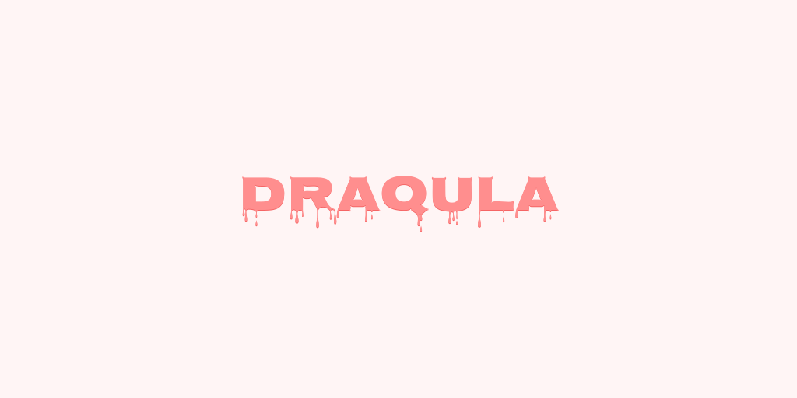

<h1 align="center">
	<br/>
	
	<br/>
	<br/>
	<br/>
</h1>

Draqula is a GraphQL client for React apps that don't need everything.
Instead of offering tons of features like extensive caching mechanism, local state management, subscriptions and so on, Draqula focuses on executing the basics well - queries and mutations.

If you want to take a quick look, keep scrolling this readme.
Otherwise, check out the documentation at https://draqulajs.com.

## Install

```console
$ npm install draqula graphql graphql-tag
```

## Features

- Simple API and codebase
- Basic cache implementation with aggressive invalidation and refetching
- Automatic retries of network/timeout errors and GraphQL queries
- Straightforward way to hook into requests without a need for middleware
- Refetches queries when window gets focused

## Usage

```jsx
import React from 'react';
import {render} from 'react-dom';
import {Draqula, DraqulaProvider, useQuery} from 'draqula';
import gql from 'graphql-tag';

const TODOS_QUERY = gql`
	query {
		todos {
			id
			title
		}
	}
`;

const Todos = () => {
	const {data, error} = useQuery(TODOS_QUERY);

	return (
		<div>
			{!data && <span>Loading…</span>}
			{error && <span>Error: {error.message}</span>}
			{data && (
				<ul>
					{data.todos.map(todo => (
						<li key={todo.id}>{todo.title}</li>
					))}
				</ul>
			)}
		</div>
	);
};

const client = new Draqula('https://my-graphql-api.com/graphql');

render(
	<DraqulaProvider client={client}>
		<Todos />
	</DraqulaProvider>,
	document.body
);
```

## Documentation

Docs can be found at https://draqulajs.com
